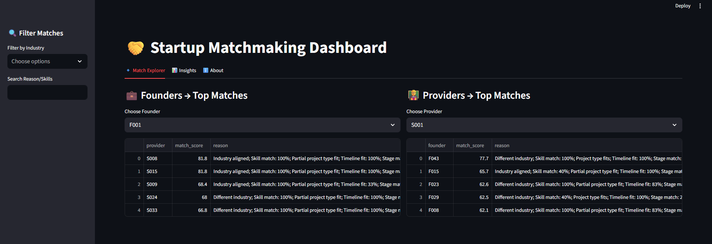
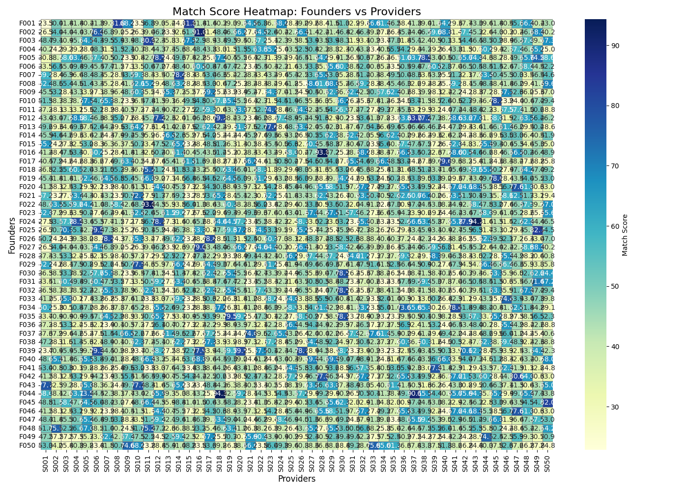

Here is a complete and professional **`README.md`** file for your **Startup Recommendation Engine** project:

---

## 🚀 Startup Recommendation Engine

This project builds a recommendation system that matches **startup founders** with **service providers** or **mentors** based on their profiles. It includes:

* Intelligent match scoring using fuzzy logic
* Heatmap visualizations of match scores
* Top-5 bidirectional recommendations (Founders ↔ Providers)
* Extensible and readable Python code

---

### 📁 Project Structure

```bash
Startup_Recommendation_Engine/
├── cleaned_User_Matching_Dataset.csv        # Input data
├── startup_match_engine.py                  # Main match engine and heatmap generator
├── founder_top_matches.csv                  # Output: Top 5 matches per founder
├── provider_top_matches.csv                 # Output: Top 5 matches per provider
├── match_matrix_heatmap.png                 # Output: Match heatmap image
├── requirements.txt                         # Python dependencies
└── README.md                                # Project documentation
```

---

### 🔍 Features

* ✅ Match scoring based on:

  * Industry alignment
  * Skill compatibility (fuzzy logic)
  * Project needs
  * Timeline alignment
  * Startup stage fit
* ✅ Bidirectional matching (founders → providers and vice versa)
* ✅ Detailed reasoning behind match scores
* ✅ Heatmap visualization of top founder-provider match scores

---

### Output

](insights.png)


### 📦 Setup Instructions

#### 1. Clone the Repository

```bash
git clone https://github.com/your-username/startup-recommendation-engine.git
cd startup-recommendation-engine
```

#### 2. Install Dependencies

```bash
pip install -r requirements.txt
```

#### 3. Run the Engine

```bash
python startup_match_engine.py
```

This will:

* Load `cleaned_User_Matching_Dataset.csv`
* Generate top matches (saved as CSVs)
* Generate and save a heatmap (`match_matrix_heatmap.png`)

---

### 📊 Heatmap Preview

The heatmap shows match scores between the top founders and all providers:

* Rows = Founders
* Columns = Providers
* Color intensity = Match Score
* Hovering reveals individual scores



---

### 📈 Matching Logic (Scoring Criteria)

| Criteria           | Description                                 | Max Score |
| ------------------ | ------------------------------------------- | --------- |
| Industry Match     | Exact match = +25                           | 25        |
| Skill Match        | Fuzzy string ratio × 25                     | 25        |
| Project Type Match | Exact = +20, Mismatch = +8                  | 20        |
| Timeline Fit       | Fuzzy match between deadline & availability | 20        |
| Startup Stage Fit  | Fuzzy match between stage & expertise       | 10        |
| **Total**          |                                             | **100**   |

---

### 🧠 Tech Stack

* Python 3.10+
* pandas
* numpy
* fuzzywuzzy
* matplotlib
* seaborn

---

### 📌 Customization Ideas

* Replace fuzzywuzzy with advanced LLM embeddings for better NLP matching
* Add Streamlit or Dash frontend
* Store results in a database
* Allow live filtering of recommendations

---

### 📜 Disclaimer

> This project is for demo and educational purposes. Matching scores are based on heuristic rules and may not reflect real-world suitability without human judgment.

---

### 👩‍💻 Author

**Lisa Pereira**
[LinkedIn](www.linkedin.com/in/lisa-pereira-developer) • [GitHub](https://github.com/lisa-7)

---

Let me know if you'd like me to include demo video links, instructions for deploying to Streamlit Cloud, or GitHub Action CI support.
